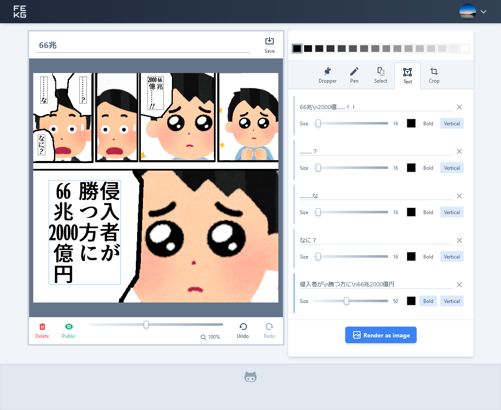

# FEKG: Fast Enough Kusokora Generator

FEKG is a small Next.js application created for learning Web Frontend.

- [Live Demo](https://fekg.vercel.app/)
- [Random notes (Japanese)](https://scrapbox.io/yubrot/FEKG:_Fast_Enough_Kusokora_Generator)

## Features

- Web application user interface with [TypeScript](https://www.typescriptlang.org/),
  [tailwind css](https://tailwindcss.com/) and
  [Next.js](https://nextjs.org/)
- Account Management with [Firebase Authentication](https://firebase.google.com/docs/auth)
- User Data Management with [Cloud Firestore](https://firebase.google.com/docs/firestore) and
  [Cloud Storage](https://firebase.google.com/docs/storage)
- GraphQL API with [GraphQL Code Generator](https://graphql-code-generator.com/),
  [graphql-request](https://github.com/prisma-labs/graphql-request),
  [SWR](https://github.com/vercel/swr) and
  [apollo-server-micro](https://www.apollographql.com/docs/apollo-server/)

## Setup

1. Copy `.env.example` to `.env`
1. [Setup Firebase project and Web app](https://firebase.google.com/docs/web/setup)

   - Copy Web app's Firebase configuration to `NEXT_PUBLIC_FIREBASE_SDK_CONFIG` in `.env` (format as JSON)
   - Generate new private key in `Settings > Service accounts` and
     Copy the generated credential JSON to `FIREBASE_ADMIN_CREDENTIAL` and database URL to `FIREBASE_ADMIN_DATABASE_URL` in `.env`

1. Configure Firebase Authentication

   - Enable Google Sign-in provider in Sign-in method
   - (Add your domain to Authorized domains)

1. Configure Firebase Cloud Firestore & Cloud Storage

   - Copy `config/cors.json.example` to `config/cors.json` and edit it to fit your environment
   - Copy Cloud Storage bucket path to `FIREBASE_ADMIN_STORAGE_BUCKET` in `.env` (Do not include `gs://`)

   ```
   cd config
   firebase deploy --project <project-id>
   gsutil cors set cors.json gs://<project-id>.appspot.com
   ```

1. `npm install`
1. `npm run dev`

## Resources

- Icons
  - [Heroicons](https://heroicons.com/)
  - [Zondicons](http://www.zondicons.com/icons.html)
  - [Entypo](http://www.entypo.com/)
- Fonts
  - [源暎アンチック](http://okoneya.jp/font/) ([SIL Open Font License](http://scripts.sil.org/OFL))
- Screenshot images
  - [いらすとや](https://www.irasutoya.com/)

## Screenshots


